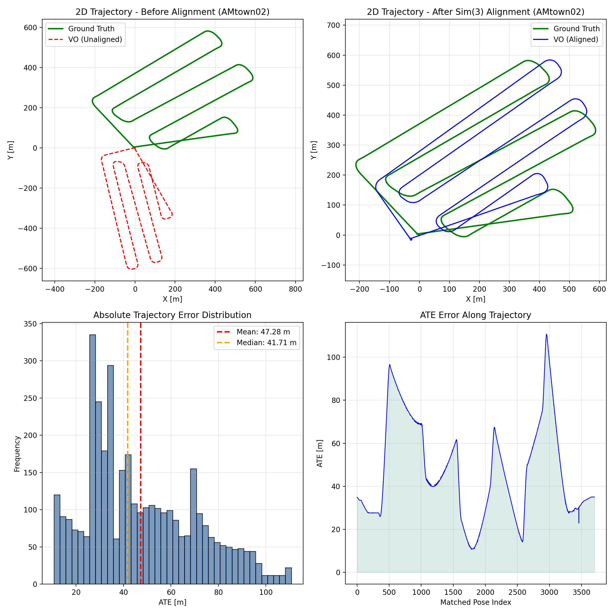

# ORB-SLAM3 Evaluation Report

- **Dataset**: AMtown02.bag
- **Ground truth**: `ground_truth.txt`
- **Estimated**: `CameraTrajectory.txt`

## Key Metrics (Sim(3) aligned, t_max_diff = 0.1 s, delta = 10 m)

- **ATE RMSE (m)**: 52.613813
- **RPE trans drift (m/m)**: 2.190259
- **RPE rot drift (deg/100m)**: 70.528018
- **Completeness (%)**: 98.77 (3703 / 3749)

## Trajectory

The following figure is saved by `evo_traj`:

## Configuration

- **Camera config**: `docs/camera_config.yaml` → `Examples/Monocular/DJI_Camera.yaml`
- **ORB-SLAM3 mode**: Monocular (`mono_tum`)
- **Vocabulary**: `Vocabulary/ORBvoc.txt`
- **Image folder**: `/data/extracted_data`
