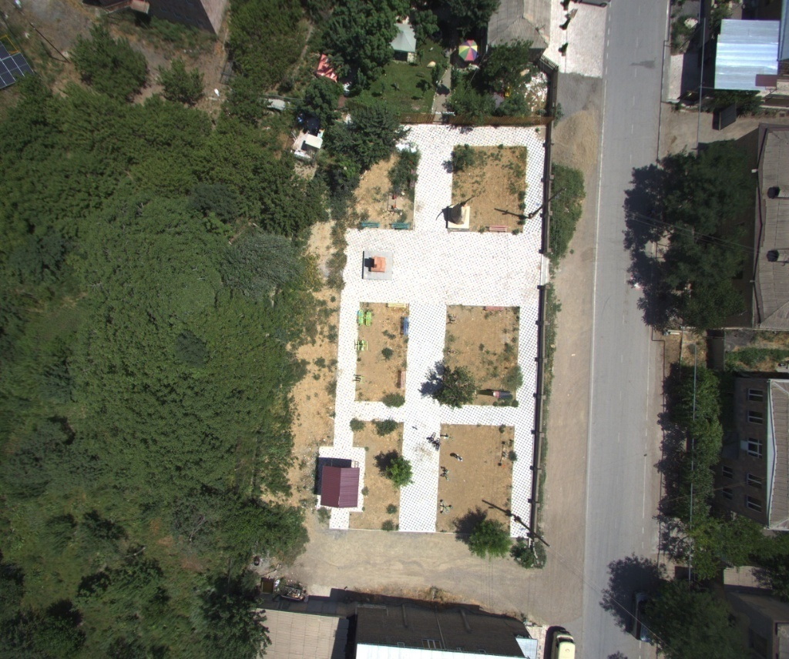
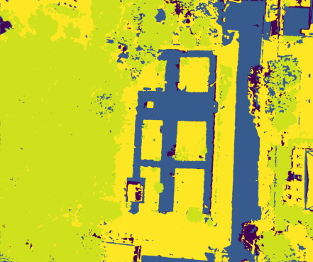

# High-Resolution Aerial Image Semantic Segmentation using PyTorch U-Net

## 1. Implementation Base & Architecture
The underlying architecture of this experiment is forked from the highly regarded GitHub repository **[`milesial/Pytorch-UNet`](https://github.com/milesial/Pytorch-UNet)**. This repository provides a highly modular and elegant PyTorch implementation of the U-Net architecture. In our experiment, the core model instantiates a standard U-Net with the following specifications:
* **Input Channels:** `n_channels=3` (RGB Images)
* **Output Classes:** `n_classes=9` (Custom 9-class setting tailored for aerial scenes)
* **Feature Extraction:** Features 4 downsampling layers (Encoder) and 4 upsampling layers (Decoder), fully retaining **Skip Connections** for high-resolution edge detail recovery.

## 2. Domain Adaptation: Carvana Baseline vs. Custom Aerial Scene
The default demonstration dataset in the `milesial` repository is the **Carvana Image Masking Challenge**. We migrated the model from this baseline task to our custom **UAV Aerial Park Dataset**. There is a significant difference in task difficulty between the two:

| Dimension | Carvana Baseline (Official Demo) | Custom Aerial Scene (Aerial Park Dataset) |
| :--- | :--- | :--- |
| **Classification Type** | Binary Classification (`classes=2`) | Multi-class Classification (`classes=9`) |
| **Target Features** | Vehicle vs. Background. Single target, clear and smooth edges, high contrast. | Intersecting distributions of paved roads, grass, tree canopies, buildings, etc. Highly complex textures. |
| **Expected Performance**| Extremely easy to converge; reaches 0.99+ Dice Score in very few epochs. | Extremely difficult to perfectly fit; places high demands on the feature fusion capabilities of Skip Connections. |

**Objective:** To verify the robustness and generalization ability of U-Net in real-world scenes with complex semantics and multi-scale targets, moving away from "clean, single-subject" laboratory datasets.

## 3. Training Constraints & Engineering Compromises
During the model training phase, due to the Docker virtual machine environment failing to pass through the host GPU, the entire training graph was forced to fall back to pure CPU computation (`Device: cpu`). To validate the pipeline within limited computational resources, we made extreme engineering compromises.

The core training script executed is as follows:
```bash
python3 train.py --epochs 1 --batch-size 1 --learning-rate 0.0001 --scale 0.1 --classes 9
```
Parameter Considerations & Compromises:

--scale 0.1: Forced downsampling of the original image to 10% in the data loader. This drastically mitigated CPU memory and computation pressure, preventing Out-Of-Memory (OOM) crashes.

--epochs 1: In a CPU environment, processing time reached ~2.39s/img. Completing a full epoch (1,221 images) took nearly 45 minutes. To ensure project progress, we preemptively halted training, executing only a single epoch of forward propagation.

## 4. Hyperparameter Tuning & Process Monitoring
**4.1 Learning Rate (LR) Tuning & Loss Analysis**
Before settling on 0.0001 as the final learning rate, we conducted comparative experiments. Different LRs had a decisive impact on model convergence:

Failure Case (LR=0.01): The learning rate was too large, causing the gradient descent step to overshoot the optimal minimum. Early in training (3% progress), the loss spiked to 16.1, resulting in gradient divergence and failure to converge.

Success Case (LR=0.0001): With a smaller learning rate, the optimizer descended smoothly through the complex loss function space. The loss steadily dropped to 1.36 (and eventually 0.795), indicating the model entered a healthy learning state.

**4.2 Real-time Validation & Dice Score Monitoring**
During the final 1-Epoch training, the model demonstrated solid preliminary learning capabilities:

Logs indicated that alongside calculating training loss, the model performed performance evaluations on a 135-image validation set at approximately 20% progress intervals.

Despite the extreme disadvantages of scale=0.1 and an incomplete single epoch, the Validation Dice score reached 0.756 at 60% progress (finalizing at 0.734). This proves the model successfully grasped the ability to distinguish between different macro geographical features (e.g., roads vs. vegetation).

## 5. Inference & Pseudo-Color Post-Processing
After completing 1 epoch, we used the generated Checkpoint weights for actual image mask segmentation.

Technical Challenge & Post-Processing: The raw mask output by the model is not an RGB image, but rather an array of tiny integer indices (0~8) representing the 9 classes. When mapped onto a 0-255 grayscale space, it appears "pure black" to the naked eye. To solve this, we wrote a post-processing script using matplotlib to apply a viridis colormap for category visualization.

🖼️ Visual Results Comparison
Input RGB (Scaled to 10%)



Predicted Mask (Colored Post-processing)




## 🔬 Experimental Conclusions
**Architectural Validity:** Despite strict computational limitations and parameter compromises, U-Net successfully segmented macro color blocks of "roads/open spaces" and "vegetation/buildings." The validation Dice score of ~0.75 validates the efficiency of the encoder in extracting deep semantics.

**Causes of Edge Degradation:** The final mask exhibits a noticeable "mosaic" effect. This is primarily attributed to the permanent loss of high-frequency details caused by --scale 0.1, and the fact that Epoch=1 did not allow the decoder to fully learn how to restore pixel-level edges at the original resolution via Skip Connections.

**Future Improvements:** Given future GPU support, restoring --scale to 1.0 and increasing --epochs to 50+ will result in a qualitative leap in multi-class boundary segmentation accuracy.

## Appendix: Complete Reproducibility Pipeline
Below is the complete code pipeline executed in our Linux terminal, covering data preparation, training, inference, and colorized visualization:
```python
# 1. Data Preparation (Constructing the rapid validation dataset)
cd ~/Pytorch-UNet
rm -rf data/imgs data/masks
mkdir -p data/imgs data/masks
ls /data/extracted_data/rgb/ | head -n 10 | xargs -I {} cp /data/extracted_data/rgb/{} data/imgs/
ls /data/extracted_data/masks/ | head -n 10 | xargs -I {} cp /data/extracted_data/masks/{} data/masks/

# 2. Model Training (Single epoch pure CPU compromise training)
python3 train.py --epochs 1 --batch-size 1 --learning-rate 0.0001 --scale 0.1 --classes 9

# 3. Inference (Generating the class index mask)
python3 predict.py --model checkpoints/checkpoint_epoch1.pth \
                   --input $(ls /data/extracted_data/rgb/1658132928.949668* | head -n 1) \
                   --output /data/extracted_data/mask_final.png \
                   --classes 9

# 4. Auto-colorization Script & Execution (Pseudo-color mapping)
cat << 'EOF' > colorize.py
import cv2
import matplotlib.pyplot as plt

# Read the pure black class index map in grayscale mode
mask = cv2.imread('/data/extracted_data/mask_final.png', cv2.IMREAD_GRAYSCALE)

# Apply viridis colormap and remove axes
plt.imshow(mask, cmap='viridis')
plt.axis('off')

# Save as a colored image for report presentation
plt.savefig('/data/extracted_data/mask_colorful.png', bbox_inches='tight', pad_inches=0)
EOF

python3 colorize.py